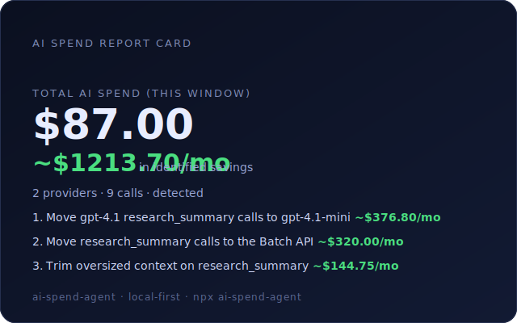

# AI Spend Analyst

[](https://www.npmjs.com/package/ai-spend-agent) [](LICENSE) [](package.json)

**Your AI spend in one view, in 90 seconds — local-first, no signup.**

```bash
npx ai-spend-agent
```

If you use **Claude Code or Codex**, that one command reads the session logs
already on your machine and shows your **real** AI usage — total dollars at
API-equivalent rates, where it goes by project, a ranked "where to cut" list,
and a **plan check** (subscription vs pay-per-token — the math no provider
shows you). Zero keys, zero signup, nothing leaves your laptop.

No agent logs? You get a full demo on sample data instead, then connect real
billing in ~2 minutes.



## Get started in 60 seconds

1. **Run it** — nothing to install, configure, or sign up for:
   ```bash
   npx ai-spend-agent
   ```
2. **Read your number.** If Claude Code or Codex logs exist on this machine,
   that's your real usage at API-equivalent rates — by project, by model,
   with a ranked cut list and the plan check.
3. **(Optional, ~2 min)** Connect verified billing with an org admin key:
   `ai-spend-agent connect openai` / `connect anthropic`. Numbers move from
   *estimated* to *verified*.
4. **Share the receipt**: `ai-spend-agent report-card` writes a redacted SVG
   + caption — no client, project, or user names ever leave redacted.

## Who this is for

- **You run a startup or freelance on AI tools** and can't answer "what is
  AI actually costing me per month?" — because the answer is split across
  four dashboards and two subscriptions that have no dashboard at all.
- **You live in Claude Code / Codex** and just got moved onto metered
  credits (Copilot June 1, Claude agent credits June 15). Your burn rate is
  invisible until the meter stops you — unless you read your own logs.
- **You lead a small team** and need to know which project, model, or
  person the spend goes to before you set budgets — without buying a
  $500/mo enterprise FinOps seat.
- **You run an agency** and want per-client AI cost attribution (the
  `--group-by client` dimension exists for exactly this).

## Why

AI billing changed in June 2026: Copilot moved to metered AI Credits (June 1),
Claude plans split agent usage into separate credit pools (June 15). Most of
that spend has **no official API to monitor it** — but it's sitting in logs on
your machine, and your API spend is one admin key away. This tool puts all of
it in one view and tells you what to cut.

## What you get

- **Headline number**: total tracked spend across every source it can see.
- **Where to cut**: ranked, dollar-specific actions (move X calls to a
  cheaper model, batch offline work for the flat 50% discount, cache repeats,
  trim oversized context) with estimated $/mo savings.
- **Plan check**: your projected monthly usage at API rates vs subscription
  plan prices ("~$253/mo at API rates — Max 20x at $200/mo covers it").
- **Drill-down**: `--group-by source|model|client|project|agent|user|workspace|apiKey`.
- **Shareable report card**: `report-card` writes a redacted SVG (no client/
  project/user names) + a paste-ready caption.
- **Honest confidence labels**: every number is tagged verified / estimated /
  detected so you know how much to trust it.

## Data sources

| Source | What | Status |
| --- | --- | --- |
| Claude Code logs (local) | Real session usage, priced at published API rates | ✅ Reads your machine's transcripts |
| Codex logs (local) | Real session usage, priced at published API rates | ✅ Reads your machine's rollouts |
| OpenAI Costs/Usage API | Verified billing, per project/key | ✅ Verified against live billing data |
| Anthropic Cost Report + Claude Code Analytics | Verified billing, per workspace | ✅ Verified against live billing data |
| Cursor Admin API | Team spend (Business plan, team admin) | 🧪 Beta — built to the published API spec; live reports welcome |
| GitHub Copilot org APIs | Metrics + seats (org/billing admin) | 🧪 Beta — built to the published API spec; live reports welcome |

## Connect verified billing

Provider **cost** APIs are admin/owner-gated, so connecting is a deliberate step:

```bash
ai-spend-agent connect openai          # ~2 min with an org-owner Admin key
ai-spend-agent connect anthropic       # ~2 min with an Admin key
ai-spend-agent connect cursor          # Cursor team-admin key (Business plan)
ai-spend-agent connect github-copilot  # GitHub billing-admin token
```

Credentials are referenced from your local environment (`--auth-reference
env:NAME`) — the tool never stores or prints a raw key.

## Commands

| Command | What it does |
| --- | --- |
| _(no command)_ | Zero-key instant readout: your local agent logs if present, sample demo otherwise |
| `quickstart [--sample]` | Same readout; `--sample` forces demo data |
| `connect <provider>` | Connect a provider's cost data (admin-gated) |
| `sync-provider` | Pull verified cost via a local `env:` reference |
| `watch [--interval N] [--cycles N]` | Re-run on an interval, report deltas + anomalies (cron-friendly) |
| `report [--out <name>]` | Generate local Markdown + HTML reports |
| `report-card [--sample]` | Redacted shareable SVG + caption |
| `scan [--path <dir>]` | Scan a local workspace for AI usage signals |
| `doctor` | Check local runtime and safety posture |

Run `ai-spend-agent --help` for the full list.

## Use it inside Cursor / Claude Desktop (MCP)

The same engine ships as a Model Context Protocol server, so your AI editor
can read your spend directly. See [`docs/MCP.md`](docs/MCP.md).

## Privacy & trust

- **Local-first.** Analysis happens on your machine; nothing is uploaded.
  No telemetry, ever.
- **No raw secrets.** Keys are referenced from your environment and redacted
  from all output and persisted state.
- **Estimates labeled as estimates.** Log-derived numbers use published API
  rates and are always tagged `estimated`; billing-API numbers are `verified`.

## Open-core

The CLI and MCP server are MIT-licensed and free, forever. A hosted tier is
in development for what local-first can't do: **continuous monitoring while
your laptop is off, burn-rate alerts before you hit Claude/Copilot/Cursor
credit caps, history and trends, and white-label client reports.** It syncs
only derived aggregates — never raw keys or line items.

**[Join the hosted beta waitlist →](https://ai-spend-agent.vercel.app)**

## Run from source

```bash
git clone https://github.com/futurastudio/ai-spend-agent
cd ai-spend-agent
npm install
npm run build
node packages/cli/dist/index.js
```

Requires Node.js >= 22.

## License

[MIT](LICENSE) © Futura Studio LLC
