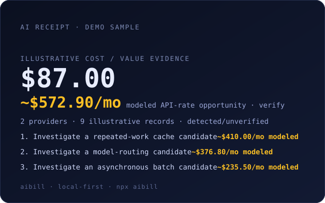

# aibill — financial intelligence for AI coding agents

[](https://github.com/futurastudio/ai-spend-agent/actions/workflows/ci.yml) [](https://www.npmjs.com/package/ai-spend-agent) [](LICENSE) [](package.json)

**Know what your AI agents consumed, where it went, what it means financially,
and what to do next—with the evidence attached.**

```bash
npx aibill         # short form — same CLI as `npx ai-spend-agent`
```

The public beta consolidates observed Claude Code and Codex activity,
subscription context, API-equivalent value, optional provider-reported cost,
attribution, runway, and Context Health into one evidence-labeled local view.
It separates what was billed from what was included in a plan and what was
calculated at API rates, so the number can support a decision instead of
becoming another misleading meter.

If you use **Claude Code or Codex**, that one command reads the session logs
already on your machine and shows observed usage estimated at API-equivalent
rates, where it goes by project/model, ranked cost opportunities with
verification steps, and detected or user-declared **plan context**. Zero keys,
zero signup, nothing leaves your laptop on this default local run. Connect a
provider's admin cost report only when you need official provider-reported
cost alongside the local evidence.

> **Public beta boundary:** CLI and the explicit MCP/plugin ship in 0.5.7.
> Glance remains a source-built macOS preview until its signed standalone
> download passes. Workspace, automatic enforcement, and ROI measurement are not
> shipped.

No agent logs? You get a full demo on sample data instead. When you're ready,
add official provider-reported cost with an OpenAI or Anthropic admin/owner
key. Availability depends on the permissions of that provider account.


*Illustrative sample output — demo data and modeled API-rate opportunities, not
provider-reported cost, an invoice, or verified savings. Regenerated from the
real CLI by `scripts/record-demo.sh` so it can't drift from the product.*

## Get started

1. **Establish the private baseline:** `npx aibill`
2. **Get the current session decision:** `npx aibill context`
3. **Optional—add official provider-reported cost:** `npx aibill connect
   openai` or `npx aibill connect anthropic`. The provider report remains
   separate from local API-equivalent estimates.
4. **Optional—ask why through AI:** configure the explicit-only MCP/plugin.
5. **Share a redacted report card:** `npx aibill report-card` writes an SVG and
   caption without client, project, or user names.

## Who this is for

- **You run a startup or freelance on AI tools** and can't answer what you are
  paying for, what your agents consumed, and whether those are the same number.
  The evidence is split across provider reports, subscriptions, and local logs.
- **You live in Claude Code / Codex** and the meters keep coming — Copilot's
  AI Credits plus Claude's mix of plan limits, model-specific usage credits,
  and optional API overages. Your burn rate is hard to compare until you read
  your own logs.
- **You lead a small team** and need to know which project, model, or person
  owns the available usage evidence before you set budgets, without uploading
  raw conversations to a shared dashboard.
- **You run an agency** and want per-client usage or cost attribution where the
  source exposes that dimension (`--group-by client`).

## What a trustworthy spend view lets you decide

A dashboard is not the outcome. The view is useful when it changes what a
developer, engineering leader, agency owner, or finance team does next:

| Question | Decision it supports | Status |
| --- | --- | --- |
| What are we actually paying for? | Put official provider-reported cost beside purchased credits, subscription capacity, and API-equivalent value without adding them together as if they were the same thing. | Available in the beta; provider reporting is optional and admin-gated. Final invoices may still include credits, discounts, tax, or adjustments. |
| Who or what owns the usage? | Use observed project, model, agent, user, workspace, or client dimensions as inputs to allocation or rebilling decisions. | Available only where the source exposes the dimension; coverage gaps stay visible. |
| How likely is an interruption? | Use provider-reported windows and reset time with a separately labeled exhaustion projection to assess runway or investigate unusual burn. | Available when the coding agent reports the limit metadata; missing windows are never guessed. |
| Where might capacity be avoidable? | Investigate oversized context, items with no observed invocation, repeated reads, model mix, and anomalies; then verify whether an intervention changed the next run. | Context Health and recommendations are available now; causality is not assumed. |
| Which workflow produces the best accepted result? | Compare cost, attempts, rework, tests, review, and acceptance instead of optimizing for tokens or lines of code alone. | Next: the open Agent Economics Receipt and `aibill outcome`. |
| What should the company scale, constrain, or stop? | Join cost evidence to accepted outcomes, budgets, ownership, approvals, and policy results. | Next: `aibill guard` and the opt-in Workspace; not claimed as shipped in this beta. |

aibill's beta establishes the cost-and-capacity evidence: provider-reported
cost, subscription context, API-equivalent value, ownership, coverage, and
what is missing. The roadmap then links that ledger to accepted outcomes. ROI
additionally requires independently measured monetary value; the beta does not
calculate productivity or ROI.

## Why

AI coding cost now mixes several systems. [GitHub moved Copilot usage to AI
Credits on June 1, 2026](https://github.blog/changelog/2026-06-01-updates-to-github-copilot-billing-and-plans/);
Claude combines shared plan limits with
model-specific usage credits and optional API overages depending on plan.
Those meters run in different dashboards, and local coding-agent usage is also
sitting in logs on your machine. This tool puts the available evidence in one
view, keeps local estimates separate from provider reports, and ranks what to
investigate and how to verify it.

## What you get

- **Evidence ledger**: provider-reported cost, local API-equivalent value,
  detected subscription context, missing cost, source, freshness, and coverage
  stay visibly separate.
- **Cost opportunities**: ranked records worth investigating, with modeled
  API-rate impact and a verification step. These are not verified savings;
  confirm quality and the next provider report before claiming a result.
- **Context inventory and invocation evidence**: shows what is discoverable,
  explicitly invoked, MCP-schema-loaded, hook-injected, unmeasured, or
  invocation-unobservable. It says an item was not invoked only where the host
  transcript format supports that conclusion, and estimates overhead only
  where the relevant context size is measurable.
- **Hook-aware Context Health**: `npx aibill context` distinguishes context
  that is merely discoverable, explicitly invoked, MCP-schema-loaded, or
  injected by an installed lifecycle hook. Hook commands are never executed
  and their runtime payload stays `unmeasured`; the session action is based on
  this user's same-agent transcript history, not a generic threshold. Items
  whose host transcript does not expose an invocation event are labeled
  invocation-unobservable and excluded from “never invoked.”
- **Plan context and comparison**: compares local usage valued at published API
  rates with a plan label detected from whitelisted local account metadata or
  supplied with `--plan`. This is comparison math—not proof of incremental
  spend, remaining entitlement, plan coverage, or the cheapest plan. Reported
  limit windows are shown separately when available.
- **Drill-down**: `--group-by source|model|client|project|agent|user|workspace|apiKey`.
- **Shareable AI Receipt**: `report-card` writes a redacted SVG (no client/
  project/user names) + a paste-ready caption.
- **Honest confidence labels**: every number is tagged verified / estimated /
  detected_unverified / missing so you know what evidence supports it.



*The shareable AI Receipt (`report-card`) — redacted SVG with illustrative demo
data. Modeled opportunities require verification before they can be called savings.*

## Local estimates and provider reports

Every number carries a confidence label so you never mistake an estimate for a
bill:

| Label | What it means |
| --- | --- |
| `verified` | Official provider-reported cost or usage from an authenticated API/export. Source-authoritative, but not necessarily the final invoice. |
| `estimated` | Local usage priced at published API rates. Comparison math—not a subscription charge or invoice. |
| `detected_unverified` | A local signal was detected but **not** reconciled against billing. |
| `missing` | Usage exists but there's no cost basis to price it. |

Numbers read from your local **Claude Code / Codex** logs are always
`estimated` at API-equivalent rates — never `verified`. Connecting provider
billing adds official provider-reported cost beside the local API-rate
estimate. It does not convert a transcript estimate into an invoice line item.

## Data sources

| Source | What | Status |
| --- | --- | --- |
| Claude Code logs (local) | Observed transcript usage, priced at published API rates | ✅ Reads supported fields from your machine's transcripts |
| Codex logs (local) | Observed rollout usage, priced at published API rates | ✅ Reads supported fields from your machine's rollouts |
| OpenAI Costs/Usage API | Admin-gated billing, per project/key | ✅ Implemented and live-verified |
| Anthropic Cost Report + Claude Code Analytics | Admin-gated billing/usage, per workspace | ✅ Implemented and live-verified |
| Cursor Admin API | Team spend (Business plan, team admin) | 🧪 Fixture-verified beta; live account QA pending |
| GitHub Copilot org APIs | Metrics + seats (org/billing admin) | 🧪 Fixture-verified beta; live account QA pending |
| Cursor / Gemini CLI / Cline / Aider local sessions | Local transcript parsing | 🔜 Planned — parsers welcome ([request an agent or provider](https://github.com/futurastudio/ai-spend-agent/issues/new/choose)) |

**Model price coverage:** local-log estimates use published list prices for
Anthropic, OpenAI, Google (Gemini), DeepSeek, Moonshot (Kimi), and xAI (Grok)
models. Open-weight models (Llama, Qwen, Mistral, GLM) have no canonical
price — hosting rates vary several-fold — so those records are honestly
labeled `missing` rather than guessed. New model out? One pricing rule +
a PR: `packages/core/src/modelPricing.ts`. The bundled table exposes its
`pricingAsOf` date in the Glance provenance contract; GPT-5.2 through GPT-5.6
rates were checked against the official OpenAI model pages on 2026-07-28.

## Connect provider cost and usage

Provider APIs are admin/owner-gated, so connecting is a deliberate step.
OpenAI and Anthropic cost reports can add official provider-reported cost;
Cursor and Copilot remain labeled according to their beta evidence:

```bash
npx aibill connect openai          # requires an org-owner Admin key
npx aibill connect anthropic       # requires an Admin key
npx aibill connect cursor          # fixture-verified beta; live QA pending
npx aibill connect github-copilot  # seat estimates + usage evidence; live QA pending
```

Credentials are referenced from your local environment (`--auth-reference
env:NAME`) — the tool never stores or prints a raw key.

## Commands

| Command | What it does |
| --- | --- |
| _(no command)_ | Zero-key instant readout: your local agent logs if present, sample demo otherwise |
| `quickstart [--sample]` | Same readout; `--sample` forces demo data |
| `connect <provider>` | Connect a provider's cost data (admin-gated) |
| `sync-provider` | Pull provider cost/usage through a local `env:` reference; confidence follows the source |
| `context [--project <name>] [--since-days N]` | Human-readable hook-aware Context Health (`--json` emits the canonical contract) |
| `glance [--project <name>] [--plan <id>]` | Emit the local machine-readable Glance snapshot |
| `watch [--interval N] [--cycles N]` | Re-run on an interval, report deltas + anomalies (cron-friendly) |
| `report [--out <name>]` | Generate local Markdown + HTML reports |
| `report-card [--sample]` | Your AI Receipt — redacted shareable SVG + caption |
| `scan [--path <dir>]` | Scan a local workspace for AI usage signals |
| `doctor` | Check local runtime and safety posture |

Run `npx aibill --help` for the full list.

## Choose your interface

All three interfaces consume the same core data and Context Health contract:

| Interface | Best for | Command / install |
| --- | --- | --- |
| Terminal | Private, scriptable inspection with no AI-client handoff | `npx aibill` and `npx aibill context` |
| MCP/plugin | Asking an AI client to explain the same structured result on demand | Install the optional aibill plugin or configure `@agent-finops/mcp` |
| macOS Glance | A hover-only monitor with one focus-aware, copy-to-agent next move | Build the current prototype from `apps/glance-macos` |

Contract tests compare terminal JSON, MCP, and Glance decision fields. Custom
interfaces should render `aibill glance` or `aibill context --json` instead of
adding another transcript parser.

### The most complete workflow

The interfaces work best as one local loop:

1. Run `npx aibill` once to establish local Claude Code/Codex usage,
   attribution, plan context, and API-equivalent value.
2. Run `npx aibill context` when deciding whether to continue the current
   session or start fresh before a new task.
3. Keep the optional macOS Glance companion running for current work, reported
   five-hour/weekly runway, reset or projected exhaustion, freshness, and one
   action. Click its compact action only when you want to copy a project-aware
   handoff into your coding agent.
4. Invoke the optional MCP/plugin only when you want an AI client to explain
   the same structured result conversationally.
5. Connect OpenAI or Anthropic only when official provider-reported cost is
   needed; local estimates, subscription context, and provider reports remain
   separate.

Terminal is the most complete private inspection surface, Glance is the
monitor and momentum surface, and MCP is the on-demand explanation layer.
Glance can prepare a safe handoff, but it does not become an always-on prompt
injector or run an agent by itself. None maintains separate usage or Context
Health logic.

## Use it inside an AI client (MCP or optional plugin)

The same engine ships as `@agent-finops/mcp`, so any stdio-compatible MCP
client can read local Claude Code/Codex estimates or sync official OpenAI and
Anthropic provider reports through reference-only credentials:

```bash
npx --yes --package @agent-finops/mcp@latest ai-spend-mcp
```

GitHub Copilot and Cursor connectors are fixture-verified and remain labeled
accordingly until live account QA. See [`docs/MCP.md`](docs/MCP.md) for client
configuration, all eight tools, and the safety model.

Beta problem? [Report a bug or request an agent/provider
format](https://github.com/futurastudio/ai-spend-agent/issues/new/choose).

Codex users can instead install the thin, explicit-only plugin in
[`plugins/aibill`](plugins/aibill). It exposes the same MCP plus
`$aibill-check`, `$aibill-explain`, and `$aibill-help`. The plugin adds no
lifecycle hooks and no always-on instructions.

## Glance for macOS

The native Glance prototype stays completely hidden until the pointer reaches
the top menu bar, so it does not sit over movies or full-screen video. In the
menu bar, one tiny liquid-glass `aibill` wordmark appears to the left of the
camera/notch. Hover that fixed target—no click required—to slide down
current-session value at API rates, available
five-hour/weekly limits, reset or exhaustion timing, a local transcript-derived
description of the user's main work focus, and one actionable Context Health
and runway decision. The final row shows only a short project-aware label and reason;
clicking it copies a longer handoff prompt for any coding agent, while nothing
runs automatically. Moving
away hides the panel again.

Glance reads the same local Claude Code and Codex transcript metadata as the
CLI. A detected monthly subscription is shown beside the API-rate value so it
cannot be mistaken for incremental spend. Nothing is uploaded, estimates stay
labeled, and each limit window that an agent did not report remains explicitly
unavailable. “Main focus” ranks observed prompt/tool activity rather than cost,
and uses a project, file, automation, or delegated-agent label only when local
evidence supports it. The current app is a source-built prototype;
the public install will be a Developer ID-signed and Apple-notarized Mac
download from the website and GitHub Releases. See
[`apps/glance-macos/README.md`](apps/glance-macos/README.md) to test it locally.

Each Glance field carries its own provenance instead of inheriting one vague
“local” label:

| Glance field | User-specific source | What Glance does |
| --- | --- | --- |
| Session/model/project | Local Claude Code transcript or Codex rollout metadata | Reports the latest observed session |
| API-rate value | Local transcript token counts + published provider list prices | Calculates an estimate locally; never calls it a bill |
| Subscription context | Whitelisted plan claims in the agent's local account metadata, or an explicit `--plan` override | Labels whether the plan was detected or user-declared |
| Five-hour/weekly headroom | Rate-limit metadata embedded by the coding agent in its local transcript | Reports only windows actually present |
| Exhaustion time | Reported headroom + reset time | Calculates a separate local pace estimate |
| Main focus | Local prompt/tool activity | Returns a short activity summary, never raw prompt text |
| Context Health | This user's prior same-agent sessions + local skill/MCP/plugin configuration and transcript invocations | Reuses the canonical CLI/MCP decision; hook commands are not run and hook payload size is not inferred |
| Next move | Canonical Context Health + Main focus + transcript-reported runway | Shows one compact action and copies a verification-first handoff; never auto-runs an agent |

The machine-readable snapshot includes the same mapping under `provenance`,
including the price-table date and `uploaded: false`, so custom UIs do not
have to infer trust from display copy.

Glance refreshes its local snapshot every 30 seconds while running. The footer
shows the age of the last successful update, changes to stale after 75 seconds,
and keeps the last good result visibly labeled if refresh fails. Launch at
login is available in source builds. Signed Sparkle updates remain disabled
unless a release embeds a valid feed and key; no signed public build exists yet.

The Glance source is MIT-licensed and intentionally editable. Fork it to
change the panel size, placement, visual treatment, refresh interval, or which
fields appear in the hover card. The shared `aibill glance`
JSON contract keeps custom interfaces on the same local, evidence-labeled data
as the CLI and MCP server.

The preregistered 8–12-person comprehension/retention protocol is public at
[`benchmarks/glance-comprehension/README.md`](benchmarks/glance-comprehension/README.md).
Its blank scorecard is not a launch result; broad-distribution claims wait for
real participant sessions and the day-seven follow-up. Mac users can
[volunteer for the Glance preview
study](https://ai-spend-agent.vercel.app/?ref=github-glance-study#beta); the
current form records interest, not access to a signed download.

## Privacy & trust

- **Local-first by default.** CLI and Glance transcript analysis happens on
  your machine and sends no telemetry. A deliberate provider connection sends
  the referenced credential only to that provider's official API.
- **Explicit MCP boundary.** When you invoke an MCP tool or plugin skill, its
  selected structured result is returned to that AI client and follows the
  client's data policy. The aibill process itself makes no telemetry/upload
  request.
- **No raw secrets.** Keys are referenced from your environment and redacted
  from all output and persisted state.
- **Estimates labeled as estimates.** Log-derived numbers use published API
  rates and are always tagged `estimated`. OpenAI and Anthropic cost-report
  numbers are `verified`; Copilot seat-price reconciliation and the beta
  Cursor connector are honestly tagged `estimated` until reconciled against a
  real invoice.

## Open core, optional Workspace

The CLI, parsers, MCP/plugin, public contracts, generated local action
artifacts, and Glance source are MIT-licensed. Local-only mode remains useful,
free, and private. The planned Workspace is the paid coordination layer: explicit
aggregate-only synchronization, organizational history, provider-invoice
reconciliation, allocation, budgets, anomaly routing, approvals, and
evidence-backed cost per accepted outcome where coverage supports it. It will
never be required to inspect a user's own local data.

**[Apply as a Workspace design partner →](https://ai-spend-agent.vercel.app/?ref=github-readme#beta)**

See the [public roadmap](ROADMAP.md) for the evidence-first sequence and its
explicit non-goals.

## Run from source

```bash
git clone https://github.com/futurastudio/ai-spend-agent
cd ai-spend-agent
npm install
npm run build
node packages/cli/dist/index.js
```

Requires Node.js >= 22.

## License

[MIT](LICENSE) © Futura Studio LLC
